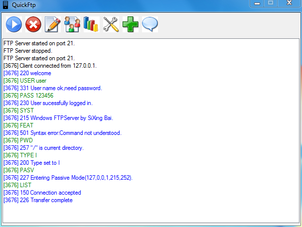
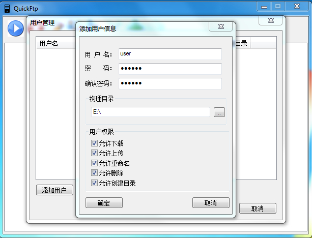
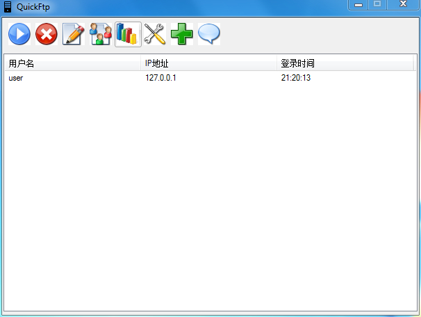
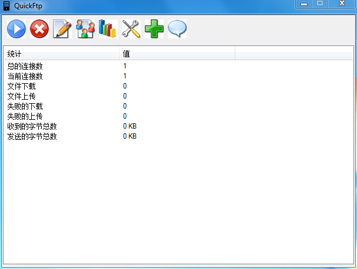
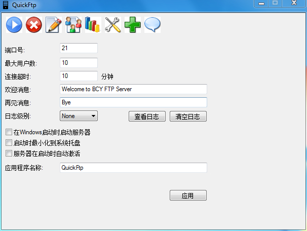

[使用C++实现一款Windows平台上的小型FTP服务器](https://blog.csdn.net/bcypxl/article/details/17690125)

使用技术：C++,MFC

软件展示图：

1.开启服务器后，使用一个FTP客户端进行连接测试，程序主界面运行展示图：

2.可以建立用户账户信息：

3.统计在线用户信息：

4.统计和FTP客户端交互的一些信息：

5.可以对服务器进行一些配置：

